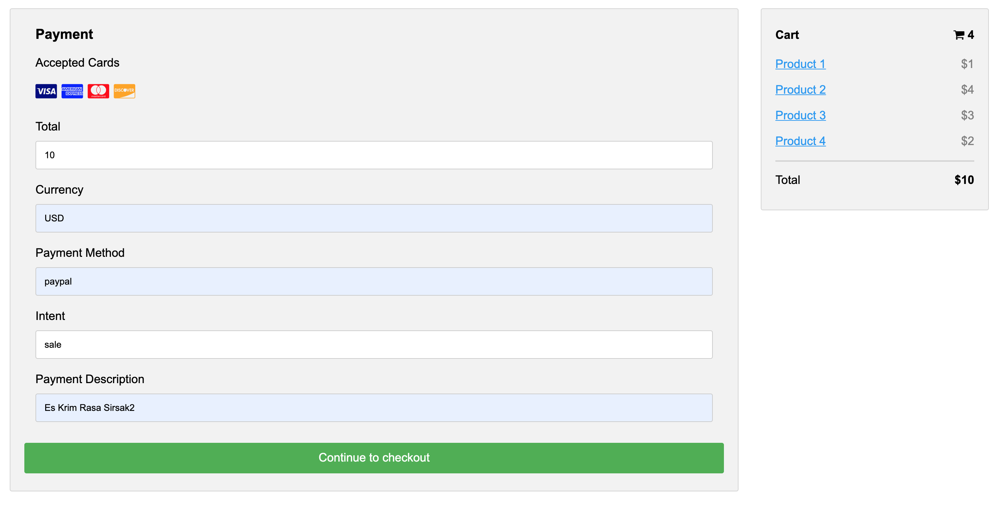

# spring-boot-paypal
Spring Boot Paypal Example
### Things todo list:
1. Clone this repository: `git clone https://github.com/hendisantika/spring-boot-paypal.git`
2. Navigate to the folder: `cd spring-boot-paypal`
3. Run the application: `mvn clean spring-boot:run`
4. Open your favorite browser: https://localhost:8080

### Images Scren shot

Home Page

Success Page

